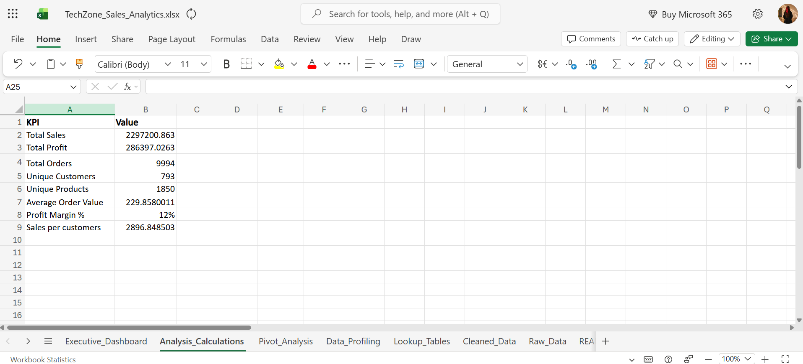

# 📊 TechZone Sales Analytics Project

An end-to-end **Advanced Excel Sales Analytics Project** designed to transform raw sales data into meaningful business insights using data cleaning, profiling, analysis, lookup functions, Pivot Tables, KPI reporting, and an interactive dashboard.

---
# 📌 Project Overview

This project demonstrates a complete sales analytics workflow using Microsoft Excel. The dataset was cleaned, validated, analyzed, and transformed into an interactive dashboard to support business decision-making.

The project focuses on improving data quality, identifying trends, monitoring KPIs, and creating dynamic reports that help stakeholders understand sales performance across different regions, categories, and time periods.

---

# 🎯 Project Objectives

- Clean and prepare raw sales data.
- Perform data profiling and validation.
- Identify missing values and inconsistencies.
- Detect potential outliers.
- Build lookup tables using Excel lookup functions.
- Create Pivot Tables for business analysis.
- Design KPI cards for performance tracking.
- Develop an interactive sales dashboard using slicers.

---

# 🛠️ Tools & Skills Used

- Microsoft Excel
- Pivot Tables
- Pivot Charts
- Slicers
- XLOOKUP
- Data Cleaning
- Data Profiling
- Outlier Analysis
- KPI Dashboard
- Interactive Dashboard Design

---
# 🧹 Data Cleaning

The raw sales dataset was cleaned to improve data quality and ensure reliable analysis.

### Cleaning Tasks Performed

- Removed duplicate records
- Identified and handled missing values
- Corrected inconsistent city names
- Standardized data formatting
- Validated customer and product information
- Checked for blank cells
- Prepared data for Pivot Tables and dashboard reporting

This process significantly improved the accuracy and consistency of the dataset before analysis.

---

# 📈 Data Profiling

A comprehensive data profiling process was performed to better understand the dataset.

The following checks were completed:

- Total Orders
- Total Customers
- Total Products
- Missing Values
- Duplicate Records
- Missing Cities
- Missing Sales Values
- Inconsistent City Names
- Unique Categories
- Data Completeness Validation

The profiling step ensured that the dataset was suitable for business analysis and dashboard creation.

---

# 📉 Outlier Analysis

Outlier analysis was performed to identify unusual sales values that could influence business insights.

The analysis included:

- Average Sales
- Standard Deviation
- Upper Control Limit
- Lower Control Limit
- Identification of Potential Outliers

This helped evaluate the quality of sales data and understand unusual transaction patterns.

---

# 🔍 Lookup Tables

Lookup Tables were created to simplify data retrieval and improve reporting efficiency.

### Excel Functions Used

- XLOOKUP
These functions were used to retrieve related information accurately and reduce manual work during analysis.

---
---

# 📊 KPI Dashboard

The KPI Dashboard was created to track key business performance indicators and provide quick insights into overall sales performance.

### Key Metrics Included:

- Total Sales
- Total Orders
- Total Customers
- Average Sales Value

---
# 🎥 Project Demo

Watch the complete walkthrough of this project here:

**🎬 Loom Video Demo:**  
https://www.loom.com/share/556ef5c9a89e4e2782e59151fd41ce65

Or click here:

▶️ **[Watch the Full Project Demo](https://www.loom.com/share/556ef5c9a89e4e2782e59151fd41ce65)**

---
